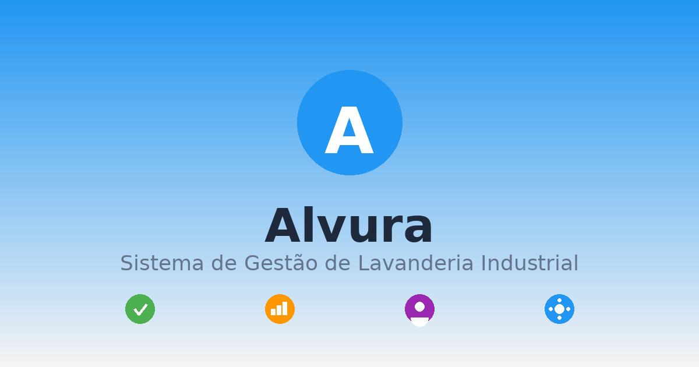

# Alvura - Sistema de Gestão de Lavanderia Industrial

<div align="center">



**Sistema web completo para gestão de lavanderia industrial com foco em hotelaria**

[](https://dotnet.microsoft.com/)
[](https://dotnet.microsoft.com/apps/aspnet/web-apps/blazor)
[](https://mudblazor.com/)
[](LICENSE)

[Protótipo em Produção](https://alvura.carrijoga.com.br) • [Documentação](#documentação) • [Roadmap](ROADMAP.md)

</div>

---

## 📋 Sobre o Projeto

**Alvura** é um sistema de gestão completo desenvolvido para lavanderias industriais que atendem o setor hoteleiro. O sistema oferece controle total de ordens de serviço, gerenciamento de clientes, controle de estoque, gestão financeira e relatórios detalhados.

### 🎯 Objetivo

Digitalizar e otimizar o processo completo de lavanderia industrial, desde a coleta até a entrega, com rastreamento em tempo real, gestão financeira integrada e analytics para tomada de decisão.

### ✨ Características Principais

- **Gestão de Ordens de Serviço** - Controle completo do ciclo de vida das ordens
- **Portal de Clientes** - Gestão de hotéis e clientes corporativos
- **Controle de Estoque** - Gerenciamento de insumos e produtos
- **Gestão Financeira** - Faturamento, pagamentos e controle de caixa
- **Relatórios e Analytics** - Dashboards e relatórios customizáveis
- **Sistema de Rastreamento** - Timeline detalhada de status em tempo real
- **Multi-dispositivo** - Interface responsiva para desktop, tablet e mobile
- **PWA Ready** - Instalável como aplicativo nativo

---

## 🏗️ Arquitetura do Projeto

O projeto utiliza uma **arquitetura dual-stack** para desenvolvimento eficiente:

```
┌─────────────────────────────────────────────────────────┐
│                    ALVURA SYSTEM                        │
├─────────────────────────────────────────────────────────┤
│                                                         │
│  📁 /docs (Protótipos HTML/CSS/JS)                     │
│  ├─ 18 páginas HTML completas                          │
│  ├─ Design system implementado                         │
│  ├─ Lógica de negócio mockada                          │
│  └─ Publicado em GitHub Pages ✅                        │
│                                                         │
│  📁 /Alvura (Aplicação Blazor WASM)                    │
│  ├─ Frontend: Blazor WebAssembly + MudBlazor           │
│  ├─ Layout e navegação ✅                               │
│  ├─ Componentes em desenvolvimento 🚧                   │
│  └─ Backend: ASP.NET Core Web API 🚧                    │
│                                                         │
└─────────────────────────────────────────────────────────┘
```

### Por Que Essa Abordagem?

1. **Protótipo Primeiro**: Interface completa em HTML permite validação rápida de UX/UI
2. **Especificação Visual**: Protótipos servem como documentação viva para desenvolvedores
3. **Desenvolvimento Paralelo**: Backend e migração Blazor podem acontecer simultaneamente
4. **Demonstrações**: Stakeholders podem testar protótipos funcionais antes da implementação final
5. **Redução de Risco**: Mudanças de requisitos são baratas de implementar em protótipos

> **Status Atual**: Protótipos 100% completos | Blazor em migração ativa | Backend planejado

Veja mais detalhes em [ARCHITECTURE.md](ARCHITECTURE.md)

---

## 🚀 Começando

### Pré-requisitos

- [.NET 10 SDK](https://dotnet.microsoft.com/download/dotnet/10.0)
- [Node.js 18+](https://nodejs.org/) (opcional, para desenvolvimento dos protótipos)
- [Visual Studio 2022](https://visualstudio.microsoft.com/) ou [VS Code](https://code.visualstudio.com/)
- SQL Server 2019+ (para produção) ou SQL Server Express (para desenvolvimento)

### Instalação Rápida

#### 1. Clone o Repositório

```bash
git clone https://github.com/carrijoga/Alvura.git
cd Alvura
```

#### 2. Execute os Protótipos HTML (Opcional)

```bash
cd docs
# Abra index.html no navegador ou use um servidor HTTP local
python -m http.server 8000
# Acesse: http://localhost:8000
```

#### 3. Execute a Aplicação Blazor

```bash
cd Alvura
dotnet restore
dotnet run
# Acesse: https://localhost:5001
```

Para instruções detalhadas de setup, consulte [SETUP.md](SETUP.md)

---

## 📦 Módulos do Sistema

| Módulo | Status HTML | Status Blazor | Descrição |
|--------|-------------|---------------|-----------|
| 🏠 **Dashboard** | ✅ Completo | 🟡 Shell | Métricas principais, gráficos e visão geral |
| 📋 **Ordens de Serviço** | ✅ Completo | 🔴 Planejado | CRUD completo com timeline de status |
| 👥 **Clientes** | ✅ Completo | 🔴 Planejado | Gestão de hotéis e clientes corporativos |
| 📦 **Estoque** | ✅ Completo | 🔴 Planejado | Controle de insumos e produtos |
| 💰 **Financeiro** | ✅ Completo | 🔴 Planejado | Faturamento, pagamentos e conciliação |
| 📊 **Relatórios** | ✅ Completo | 🔴 Planejado | Analytics e exportação de dados |
| ⚙️ **Configurações** | ✅ Completo | 🔴 Planejado | Parâmetros do sistema |

**Legenda**: ✅ Completo | 🟡 Em Progresso | 🔴 Planejado | ⚪ Não Iniciado

---

## 🛠️ Stack Tecnológica

### Frontend

- **Framework**: [Blazor WebAssembly](https://dotnet.microsoft.com/apps/aspnet/web-apps/blazor) (.NET 10)
- **UI Library**: [MudBlazor 8.14.0](https://mudblazor.com/) (Material Design)
- **Protótipos**: HTML5, CSS3, JavaScript (ES6+)
- **Gráficos**: [Chart.js](https://www.chartjs.org/)
- **Ícones**: [Font Awesome 6](https://fontawesome.com/)
- **Tipografia**: [Google Fonts - Inter](https://fonts.google.com/specimen/Inter) / Roboto

### Backend (Planejado)

- **API**: ASP.NET Core 10 Web API
- **ORM**: Entity Framework Core 10
- **Database**: SQL Server 2019+
- **Auth**: JWT + Identity
- **Real-time**: SignalR
- **Documentação**: Swagger/OpenAPI

### DevOps (Planejado)

- **Containerização**: Docker + Docker Compose
- **CI/CD**: GitHub Actions
- **Hospedagem**: Azure App Service / IIS
- **Monitoramento**: Application Insights

---

## 📂 Estrutura do Projeto

```
Alvura/
├── 📁 Alvura/                      # Aplicação Blazor WebAssembly
│   ├── Pages/                      # Páginas/Rotas
│   │   ├── Dashboard.razor
│   │   └── NotFound.razor
│   ├── Shared/                     # Componentes compartilhados
│   │   ├── MainLayout.razor
│   │   └── Layout/
│   │       └── Navbar/             # Componentes de navegação
│   ├── wwwroot/                    # Assets estáticos
│   │   ├── css/
│   │   ├── js/
│   │   └── manifest.json           # PWA manifest
│   ├── App.razor                   # Raiz da aplicação
│   ├── Program.cs                  # Entry point + DI
│   └── Alvura.csproj
│
├── 📁 docs/                        # Protótipos HTML + GitHub Pages
│   ├── index.html                  # Dashboard
│   ├── ordens.html                 # Lista de ordens
│   ├── criar-ordem.html            # Criar ordem
│   ├── detalhes-ordem.html         # Detalhes da ordem
│   ├── clientes.html               # Gestão de clientes
│   ├── estoque.html                # Controle de estoque
│   ├── financeiro.html             # Gestão financeira
│   ├── relatorios.html             # Relatórios
│   ├── *.js                        # Lógica de negócio
│   ├── *.css                       # Estilos customizados
│   ├── assets/                     # Imagens e ícones
│   └── README.md                   # Documentação dos protótipos
│
├── 📄 README.md                    # Este arquivo
├── 📄 ARCHITECTURE.md              # Documentação de arquitetura
├── 📄 SETUP.md                     # Guia de instalação
├── 📄 CONTRIBUTING.md              # Guia de contribuição
├── 📄 ROADMAP.md                   # Planejamento e roadmap
├── 📄 .gitignore
└── 📄 Alvura.slnx                  # Solution file
```

---

## 🎨 Design System

### Paleta de Cores

#### Protótipos HTML
```css
Primária:    #2196F3  /* Azul */
Sucesso:     #4CAF50  /* Verde */
Aviso:       #FF9800  /* Laranja */
Erro:        #F44336  /* Vermelho */
Secundária:  #9C27B0  /* Roxo */

Status das Ordens:
- Solicitado:  #FFC107  /* Amarelo */
- Coletado:    #2196F3  /* Azul */
- Em Lavagem:  #2196F3  /* Azul */
- Secagem:     #9E9E9E  /* Cinza */
- Pronto:      #4CAF50  /* Verde */
- Entregue:    #4CAF50  /* Verde */
```

#### Aplicação Blazor (MudBlazor)
```css
Primária:    #377D7D  /* Teal */
Tema:        Material Design
Modos:       Light / Dark (com persistência)
Tipografia:  Roboto
```

---

## 🔐 Segurança

- **Autenticação**: JWT (planejado)
- **Autorização**: Role-based access control (planejado)
- **HTTPS**: Obrigatório em produção
- **CORS**: Configuração restritiva
- **Input Validation**: Client-side (HTML5) + Server-side (Data Annotations)
- **SQL Injection**: Proteção via Entity Framework

---

## 📚 Documentação

- **[ARCHITECTURE.md](ARCHITECTURE.md)** - Decisões de arquitetura e diagramas
- **[SETUP.md](SETUP.md)** - Guia completo de instalação e configuração
- **[docs/API.md](docs/API.md)** - Especificação da API REST
- **[docs/DATABASE.md](docs/DATABASE.md)** - Schema do banco de dados
- **[CONTRIBUTING.md](CONTRIBUTING.md)** - Como contribuir com o projeto
- **[ROADMAP.md](ROADMAP.md)** - Planejamento e próximos passos
- **[docs/README.md](docs/README.md)** - Documentação dos protótipos HTML

---

## 🗺️ Roadmap

### ✅ Fase 1 - Protótipos (Completo)
- [x] Design system
- [x] 18 páginas HTML funcionais
- [x] Lógica de negócio mockada
- [x] Deploy em GitHub Pages

### 🚧 Fase 2 - Frontend Blazor (Em Andamento)
- [x] Setup do projeto Blazor WASM
- [x] Integração MudBlazor
- [x] Layout e navegação
- [x] Sistema de temas (light/dark)
- [ ] Migração do Dashboard
- [ ] Módulo de Ordens de Serviço
- [ ] Demais módulos

### 📅 Fase 3 - Backend (Planejado - Q1 2025)
- [ ] Design do banco de dados
- [ ] API REST com ASP.NET Core
- [ ] Entity Framework + Migrations
- [ ] Autenticação e autorização
- [ ] SignalR para real-time

### 📅 Fase 4 - Integrações (Planejado - Q2 2025)
- [ ] WhatsApp Business API
- [ ] Geração de PDF (notas fiscais)
- [ ] Integração com gateways de pagamento
- [ ] API para app mobile de motoristas

### 📅 Fase 5 - Avançado (Planejado - Q3 2025)
- [ ] Machine Learning para previsão de demanda
- [ ] Análise preditiva de manutenção
- [ ] Portal self-service para clientes
- [ ] App mobile nativo (Android/iOS)

Veja o roadmap completo em [ROADMAP.md](ROADMAP.md)

---

## 🤝 Contribuindo

Contribuições são bem-vindas! Por favor, leia [CONTRIBUTING.md](CONTRIBUTING.md) para detalhes sobre nosso código de conduta e processo de pull requests.

### Como Contribuir

1. Fork o projeto
2. Crie uma branch para sua feature (`git checkout -b feature/NovaFuncionalidade`)
3. Commit suas mudanças (`git commit -m 'feat: Adiciona nova funcionalidade'`)
4. Push para a branch (`git push origin feature/NovaFuncionalidade`)
5. Abra um Pull Request

---

## 📝 Convenções de Código

### Commits (Conventional Commits)

```
feat: Nova funcionalidade
fix: Correção de bug
docs: Mudanças na documentação
style: Formatação de código
refactor: Refatoração
test: Adição de testes
chore: Tarefas de manutenção
```

### C# / Blazor

- Seguir [C# Coding Conventions](https://docs.microsoft.com/dotnet/csharp/fundamentals/coding-style/coding-conventions)
- Usar `async/await` para operações assíncronas
- Componentes Blazor em PascalCase
- Métodos públicos documentados com XML comments

---

## 🧪 Testes

> Em desenvolvimento

```bash
# Testes unitários
dotnet test

# Testes de integração
dotnet test --filter Category=Integration

# Cobertura de código
dotnet test /p:CollectCoverage=true
```

---

## 📊 Status do Projeto

| Aspecto | Status |
|---------|--------|
| **Protótipos** | ✅ 100% Completo |
| **Frontend Blazor** | 🟡 25% (Layout + Nav) |
| **Backend API** | 🔴 0% (Planejado) |
| **Banco de Dados** | 🔴 0% (Schema em design) |
| **Testes** | 🔴 0% (Planejado) |
| **Documentação** | 🟡 70% |

---

## 📸 Screenshots

### Dashboard


### Ordens de Serviço


### Timeline de Status


> **Nota**: Screenshots dos protótipos HTML. Interface Blazor em desenvolvimento.

---

## 🌐 Demo

**Protótipos HTML**: [https://alvura.carrijoga.com.br](https://alvura.carrijoga.com.br)

> A aplicação Blazor estará disponível em breve

---

## 📄 Licença

Este projeto está licenciado sob a Licença MIT - veja o arquivo [LICENSE](LICENSE) para detalhes.

---

## 👥 Equipe

- **Desenvolvedor**: [João Carvalho](https://github.com/carrijoga)

---

## 📞 Contato

- **Website**: [alvura.carrijoga.com.br](https://alvura.carrijoga.com.br)
- **Email**: contato@alvura.com.br
- **GitHub**: [github.com/carrijoga/Alvura](https://github.com/carrijoga/Alvura)

---

## 🙏 Agradecimentos

- [MudBlazor](https://mudblazor.com/) - Biblioteca de componentes UI
- [Chart.js](https://www.chartjs.org/) - Gráficos interativos
- [Font Awesome](https://fontawesome.com/) - Ícones
- Comunidade .NET Brasil

---

<div align="center">

**Feito com ❤️ para modernizar a gestão de lavanderias industriais**

[⬆ Voltar ao topo](#alvura---sistema-de-gestão-de-lavanderia-industrial)

</div>
